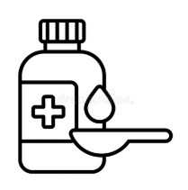

<!DOCTYPE html>

<html>

<!--Descrição do projeto-->
<head>
    <title>Como tomar?</title>
    <meta name="Etiqueta de Posologia para Idosos" content="Etiqueta para facilitar a tomada correta de medicamentos dos idosos ao voltarem para casa."> 
</head>
 <body>
    <main>
        <header>

<!--Tabela para digitação de medicamentos e posologia-->

        <table border="2">
            <thead>
                <tr>
                    <th>
                        <h2>Como tomar meu medicamento?</h2>
                    </th>
                </tr>
            </thead>
            <tbody>
                <section>
                    <form>
                        <tr>
                            <td style="text-align: center;">Nome do Medicamento:  
                                <input type="text" id="medicamento" name="medicamento" placeholder="Digite o medicamento..."> </td>
                        </tr>
                        
                        <tr>
                            <td style="text-align: center;">Apresentação:    
                                <input type="text" id="apresentacao" name="apresentacao" placeholder="Digite a apresentação..."> </td>
                        </tr>

                        <tr>
                            <td style="text-align: center;">Como tomar?:   
                                <input type="text" id="posologia" name="posologia" placeholder="Digite a posologia..."> </td>
                        </tr>

                        <tr>
                            <td style="text-align: center;">Início de tratamento:   
                                <input type="date" id="tratamento1" name="tratamento1"> </td>
                        </tr>

                        <tr>
                            <td style="text-align: center;">Final de tratamento:   
                                <input type="date" id="tratamento2" name="tratamento2"> </td>
                        </tr>
                        <tr>
                            <td style="text-align: center;">Observações:   
                                <input type="text" id="obs" name="obs" placeholder="Digite a observação..."></td>
                        </tr>
                    </form>
                </section>
                </table>

<!--Acessibilidade para não alfabetizados-->
                <section>
                    

                        
Clique aqui, e abra a acessibilidade para não alfabetizados

                        <table border="2">
            <thead>
                <tr>
                    <th>
                        <h2>Como tomar meu medicamento?</h2>
                    </th>
                </tr>
            </thead>
            <tbody>
                <section>
                <tr>
                    <td style="text-align: center;">Nome do Medicamento:(Cuidador)  
                         <input type="text" id="medicamento" name="medicamento" placeholder="Digite o medicamento..."> </td>
                </tr>
                
<!--Tabela de imagens - Apresentação do medicamento-->
                <tr>
                    <form>
                        <td style="text-align: center;">Apresentação:                        
                        <figure>
                                                    
                        </figure>

                        <figure>
                                                    
                        </figure>

                        <figure>
                                                    
                        </figure>

                        <figure>
                                                    
                        </figure>

                        <figure>
                                                    
                        </figure>
                        </td>
                    </form>

                </tr>

<!--Imagens em Como Tomar?-->
                <tr>
                    <td style="text-align: center;">Como tomar?:                        
                        <figure>
                            
                                                 
                        </figure>
                                           
                        <figure>
                                                 
                        </figure>
                       
                    
                        <figure>
                            
                       
                        </figure>
                        
                </form>

                </tr>
                
<!--Observações para os cuidadores-->
                <tr>
                    <td style="text-align: center;">Observações (Cuidador):   
                        <input type="text" id="obs" name="obs" placeholder="Digite a observação..."> </td>
                </tr>
                </section>
                </table>
                    

                </section>
            </tbody>
        
        </header>
    </main>
 </body>
<footer> 
    <tfoot>
&copy; Todos os direitos reservados. Feito por Jennifer Guedes - 244457
</tfoot> 
</footer>

</html>
